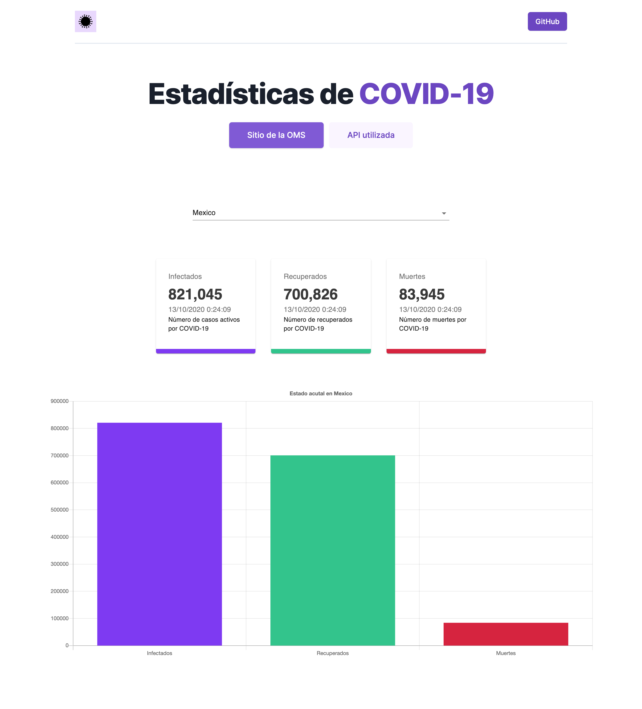

## COVID-19 Tracker App
Simple COVID-19 Tracker/Stats Application built with **React** & MaterialUI.
Using the public [JSON API](https://github.com/mathdroid/covid-19-api) of John Hopkins University CSSE that offers the COVID-19 daily data.

### Dependencies
+ axios@0.20.0
+ classnames@2.2.6
+ react-chartjs-2@2.10.0
+ chart.js
+ react-countup@4.3.3
+ @material-ui/core@4.11.0
##### dev dependencies
+ autoprefixer@10.0.1
+ postcss-cli@8.1.0
+ tailwindcss@1.9.0

### License
MIT License 2020. 
Los datos consumidos del API (perteneciente a la *Universidad de Johns Hopkins*) no me pertenecen.